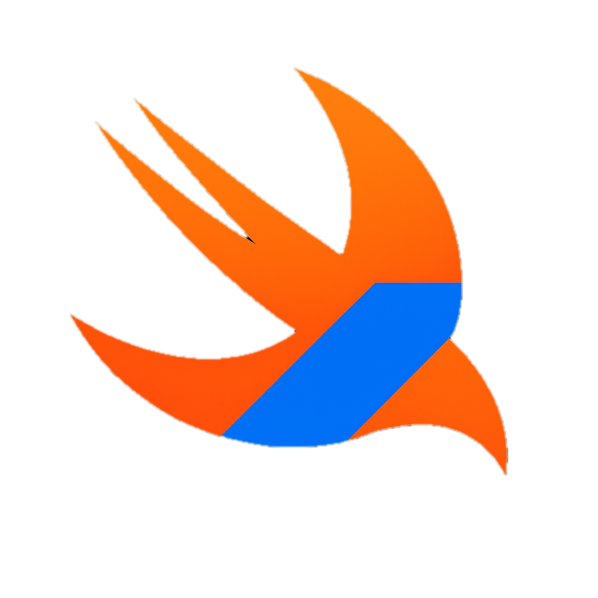

# The Swift Package Manager for Kotlin multiplatform Plugin

[](https://plugins.gradle.org/plugin/io.github.frankois944.spmForKmp)
[](https://github.com/frankois944/spm4Kmp/actions/workflows/pre-merge.yaml)
[](https://sonarcloud.io/summary/new_code?id=frankois944_spm4Kmp)
[](https://sonarcloud.io/summary/new_code?id=frankois944_spm4Kmp)
[](https://github.com/frankois944/spm4Kmp/blob/main/LICENSE)

[](https://ko-fi.com/A0A51MG1Y9)

The Swift Package Manager for Kotlin Multiplatform Plugin, aka `spmForKmp` Gradle Plugin, is an **alternative of the [dying](https://blog.cocoapods.org/CocoaPods-Specs-Repo/) CocoaPods Plugin** used by [KMP cocoapods plugin](https://kotlinlang.org/docs/native-cocoapods.html#set-up-an-environment-to-work-with-cocoapods).

It will help you to integrate Swift Package and simplify communication between Swift/Kotlin Multiplatform projects targeting the **Apple platform**.

The plugin uses the embedded Swift Package Manager, so **no third-party dependency is needed**, and it's less intrusive.

# [READ THE DOCUMENTATION](https://spmforkmp.eu/)

# QuickStart

## Gradle Plugin

``` kotlin title="build.gradle.kts"
plugins {
    id("org.jetbrains.kotlin.multiplatform")
    id("io.github.frankois944.spmForKmp") version "[version]"
}
```

## Gradle Properties

``` title="gradle.properties"
kotlin.mpp.enableCInteropCommonization=true
```

## Initial Configuration

``` kotlin title="build.gradle.kts"
kotlin {
    listOf(
        iosArm64(),
        iosSimulatorArm64()
        // and more Apple targets...
    ).forEach {
        it.compilations {
            val main by getting {
                // Choose the cinterop name
                cinterops.create("nativeBridge")
            }
        }
    }
}
```

``` kotlin title="build.gradle.kts"
swiftPackageConfig {
    create("nativeBridge") { // must match with cinterops.create name
        // your bridge and native dependencies
    }
}
```

### ⭐️ Support My Project ⭐️

If you find this project useful, please consider giving it a star!

[](https://github.com/frankois944/spm4Kmp)

[](https://ko-fi.com/A0A51MG1Y9)

## Star History

[](https://www.star-history.com/#frankois944/spm4Kmp&type=date&legend=top-left)

---

For additional help or detailed documentation, refer to the official repository or contact the plugin maintainers. Happy coding! 🎉
