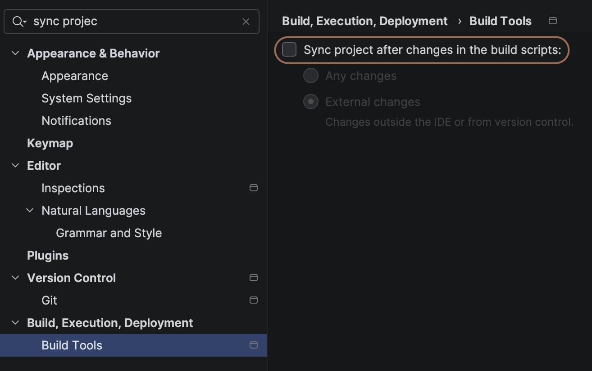

# Tips & Tricks

This page provides various tips, optimizations, and workarounds to help you get the most out of `spm4Kmp`.

---

## Importing Swift Code into Kotlin {#how-can-i-import-swift-code-into-my-kotlin-code}

If you're looking for practical examples of how to bridge Swift and Kotlin, check out the dedicated playground repository.

!!! tip "Playground Repository"
    A [playground](https://github.com/frankois944/Swift-Import-Interoperability-with-Kotlin-Multiplatform) demonstrating various Swift-Kotlin interoperability use cases is available.

The repository is regularly updated with new examples. Feedback and requests for specific use cases are always welcome!

---

## Optimizing Build Performance

### Reduce Build Time

By default, Swift Package Manager (SPM) working files are stored within the Gradle build folder. You can change this behavior using the [`spmWorkingPath`](../references/swiftPackageConfig.md#spmworkingpath) property.

!!! info "Pro Tip: Detach Working Path"
    Setting `spmWorkingPath` outside the build folder prevents working files from being deleted during a `./gradlew clean`. Additionally, you should [exclude](https://www.jetbrains.com/help/idea/indexing.html#exclude) this folder from IDE indexing to improve responsiveness.

Example configuration in your `build.gradle.kts`:
```kotlin
swiftPackageConfig {
    // ...
    spmWorkingPath = "${projectDir.resolve("SPM")}"
}
```

### CI/CD Caching

To speed up your CI/CD pipelines, ensure you cache the SPM working directory:
- The default directory: `build/spmKmpPlugin`
- Or your custom `spmWorkingPath` if set.

!!! example "GitHub Actions"
    Check the [pre-merge workflow](https://github.com/frankois944/spm4Kmp/blob/main/.github/workflows/pre-merge.yaml) for a real-world example of building with cached SPM files.

---

## Implementing Firebase

Integrating Firebase into a KMP project can be complex. We provide a complete reference implementation to guide you.

!!! info "Firebase Example"
    View the [Full Firebase KMP Demo](https://github.com/frankois944/FirebaseKmpDemo) for a step-by-step implementation.

---

## Handling Objective-C Types (`_objcnames.classes_`) {#working-with-objcnamesclasses-types}

When working with Objective-C types (like `UIView`, `UIViewController`, etc.), `cinterop` might occasionally need a "hint" to correctly map the types.

### Example Solution

If `cinterop` fails to recognize a specific type, you can force its inclusion by creating a dummy Swift class or using `NSObject` as a bridge.

```swift title="mySwiftBridge.swift"
import UIKit

// Option 1: Force cinterop to include `platform.UIKit.UIView` via a dummy class
@objcMembers public class MyDummyView: UIView {}

// Option 2: Use inheritance or explicit NSObject mapping
@objcMembers public class TestClass: NSObject {

    // Simply returning `UIView` may not always be enough for cinterop
    public func getView() -> UIView {
        return UIView()
    }

    // Using NSObject can sometimes be more reliable for mapping
    public func getViewWithNSObject() -> NSObject {
        return UIView()
    }
}
```

```kotlin title="iosMain/myKotlinFile.kt"
import platform.UIKit.UIView

// In your Kotlin code:
fun getView(): UIView = TestClass().getView()

// Or with explicit casting if using the NSObject approach:
fun getViewCasted(): UIView = TestClass().getViewWithNSObject() as UIView
```

---

## Custom Swift Versions & Toolchains {#support-xcode-15-and-earlier-or-another-version-of-swift}

!!! warning "Experimental"
    This feature is experimental and may not cover all use cases. Please [report any issues](https://github.com/frankois944/spm4Kmp/issues) you encounter.

The plugin uses the system Swift command directly. If you need to support older Xcode versions or specific Swift toolchains, you can customize the binary path.

### Using `swiftly`
We recommend using [swiftly](https://www.swift.org/blog/introducing-swiftly_10/) to manage multiple Swift versions on macOS.

1. Install the desired Swift version via `swiftly`.
2. Set the [`swiftBinPath`](../references/swiftPackageConfig.md#swiftbinpath) in your configuration:

```kotlin
spm {
    // ...
    swiftBinPath = "/path/to/.swiftly/bin/swift"
}
```

---

## Swift Concurrency in iOS Tests {#support-concurrency-in-kmp-ios-test}

If your bridge uses `async/await` and you encounter errors during KMP tests (e.g., `Library not loaded: libswift_Concurrency.dylib`), it's likely due to the minimum deployment target.

### The Problem
Kotlin Multiplatform tests often default to a low minimum target (e.g., iOS 12/14), while Swift Concurrency requires **iOS 15.0+**.

### The Fix
Override the minimum OS version for your test binaries:

```kotlin
kotlin {
    iosSimulatorArm64().binaries.getTest("debug").apply {
        freeCompilerArgs += listOf(
            "-Xoverride-konan-properties=osVersionMin.ios_simulator_arm64=16.0",
        )
    }
}
```

---

## Disabling Automatic IDE Package Resolution {#disable-swift-package-automatic-ide-resolution}

If your project contains a `Package.swift` manifest, IntelliJ/Android Studio might attempt to resolve it automatically. This can slow down the IDE and consume unnecessary disk space.

!!! tip "Recommendation"
    Disable the setting: **Sync Project after changes in the build script** in [IDE Settings](jetbrains://idea/settings?name=Build%2C+Execution%2C+Deployment--Build+Tools).

After disabling this, you can safely reclaim disk space by deleting:
`~/Library/Caches/JetBrains/IntelliJIdea[Version]/DerivedData`

<figure markdown="span">
  { width="500" }
  <figcaption>Optimizing IDE sync settings</figcaption>
</figure>

---

## Enabling Execution Tracing

To debug performance or execution flow, you can enable detailed tracing.

1. Add the following flag to your `gradle.properties`:
   ```properties
   spmforkmp.enableTracing=true
   ```
2. Find the generated traces in the `spmForKmpTrace` directory.
